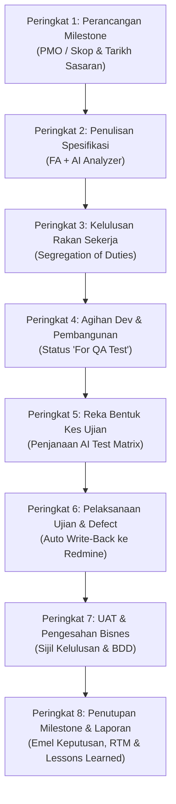

# 🎙️ QMPulse — End-to-End Live Demo Script (Bilingual: Bahasa Melayu & English)
### *Panduan Sesi Demo Sistem: Dari Penciptaan Milestone sehingga UAT Sign-Off & Penutupan Release*

---

## 📋 Ringkasan & Persediaan Sesi Demo
- **Tempoh Anggaran Demo:** 10 – 12 Minit
- **Sasaran Penonton:** Pengurusan Tertinggi C-Suite (CEO, CTO, CIO, COO, Ketua PMO/QA) & Pengarah Teknikal
- **Senario Demo:** Penghantaran Pelepasan Sistem Kritikal *(cth. "Core Banking Modernization — Sprint 14 / CR-2026")*
- **Mesej Utama (The Core Pitch):** *"Satu nadi operasi bersepadu—tiada lagi lambakan fail Excel, tiada pertukaran emel manual, 100% patuh audit, dan integrasi pintar bersama Redmine + AI."*

---

## 🎬 Senarai Semak Sebelum Memulakan Demo
1. Buka pelayar web ke `http://localhost:5173`.
2. Log masuk menggunakan akaun pentadbir/ketua *(cth. `admin` atau `qa_lead`)*.
3. Buka tab Redmine di latar belakang sekiranya ingin menunjukkan integrasi masa nyata.
4. Buka [`presenter_console.html`](file:///c:/Users/raimi.rosman/QAPulse/presenter_console.html) pada skrin komputer riba anda dan pilih bahasa **🇲🇾 Bahasa Melayu** (tekan `L` untuk tukar).

---

---

# 🇲🇾 SKRIP DEMO LANGSUNG (BAHASA MELAYU KORPORAT)

---

### 🟢 PENGENALAN: Menetapkan Konteks Eksekutif (30 Saat)

**🖥️ Paparan Skrin:** Halaman Utama (Landing Page) atau Papan Pemuka Utama (Dashboard).

**🗣️ Dialog Pembentang:**
> *"Terima kasih kepada barisan kepimpinan. Sekarang mari kita lihat QMPulse beroperasi secara langsung.\n\n"
> "Bayangkan organisasi kita sedang membangunkan inisiatif digital yang kritikal—contohnya Sistem Perbankan Pelanggan Baharu. Dalam kaedah konvensional, projek ini biasanya melibatkan lebih 15 fail Excel berasingan, puluhan rantaian emel, dan isu Redmine yang tidak disegerakkan secara langsung.\n\n"
> "Hari ini, saya akan membawa tuan-tuan dan puan-puan merentasi keseluruhan 8 peringkat penghantaran—bermula dari penetapan sasaran oleh PMO, penapisan kualiti spesifikasi menggunakan AI, pembangunan kod, pelaksanaan ujian QA dengan pendaftaran defect automatik, sehinggalah kepada kelulusan UAT dan penjanaan laporan eksekutif satu klik."*

---

### 🟢 PERINGKAT 1: Perancangan Milestone & Tadbir Urus (Paparan PMO)

**🖥️ Navigasi:** Pergi ke menu **QA Pipeline → Step 1: Milestone** (atau `/configurations`).

**🖱️ Tindakan:**
1. Pilih Projek: *(cth. "Core Banking Platform")*.
2. Masukkan Nama Milestone: `Release 2.4 - Customer Security & Payments`.
3. Pilih Jenis: `Sprint` atau `Change Request (CR)`.
4. Tunjukkan jadual tarikh sasaran mengikut fasa *(Requirements, Dev, QA, UAT, Go-Live)*.
5. Tunjukkan kotak semak: **"Requires UAT Sign-off?"** (Pastikan bertanda).
6. Klik **Save / Create Milestone**.

**🗣️ Dialog Pembentang:**
> *"Segala-galanya bermula di Peringkat 1 bersama pihak PMO. PMO menetapkan skop milestone, menetapkan tarikh sasaran bagi setiap fasa, memperuntukkan persekitaran ujian (test environment), dan mengurus risiko awal.\n\n"
> "Perhatikan fungsi 'Requires UAT Sign-Off'. Apabila diaktifkan, QMPulse menguatkuasakan pintu tadbir urus (governance gate) secara automatik—sistem tidak boleh ditutup atau dilepaskan ke 'Production' selagi dokumen penerimaan UAT belum disahkan.\n\n"
> "Sebaik sahaja PMO menyimpan milestone ini, notifikasi automatik akan dihantar terus kepada Penganalisis Fungsian (FA) dan Ketua Pembangun bahawa kitaran projek telah bermula."*

**✨ Poin Wow Eksekutif:** *"Indeks Prestasi Jadual (SPI) dijejak secara langsung pada setiap fasa, membolehkan PMO mengesan kelewatan lebih awal tanpa menunggu laporan manual."*

---

### 🟢 PERINGKAT 2: Penulisan Spesifikasi & AI Requirement Analyzer (Paparan FA)

**🖥️ Navigasi:** Klik **Step 2: Requirements** pada bar navigasi atas.

**🖱️ Tindakan:**
1. Tunjukkan senarai spesifikasi sedia ada atau klik **+ Add Requirement** (atau **Sync from Redmine**).
2. Pilih satu spesifikasi: *"Pengesahan Biometrik pada Aplikasi Mudah Alih"*.
3. Klik butang **"AI Analyze Requirement"**.
4. Tunjukkan modal AI yang memaparkan skor kejelasan, amaran kekaburan, dan cadangan kes ujian sempadan (edge cases).

**🗣️ Dialog Pembentang:**
> *"Seterusnya, Penganalisis Fungsian (FA) merekodkan spesifikasi perniagaan. Dalam industri IT, lebih 50% kecacatan perisian berpunca daripada keperluan yang tidak jelas atau kabur.\n\n"
> "Di sini, QMPulse mengintegrasikan Hab AI (Google GenAI) terbina dalam. Dalam beberapa saat, AI menganalisis teks spesifikasi dan mengesan kriteria yang tidak boleh diuji, logik yang mengelirukan, atau senario negatif yang tertinggal sebelum sebarang kod ditulis.\n\n"
> "Ini bertindak sebagai penapis kualiti pertama kita—memastikan pemaju dan QA menerima spesifikasi yang kukuh dan tepat."*

**✨ Poin Wow Eksekutif:** *"Memperbaiki ralat pada fasa keperluan menjimatkan kos sehingga 10 kali ganda berbanding membetulkannya di fasa QA atau selepas sistem digunakan."*

---

### 🟢 PERINGKAT 3: Pintu Kelulusan Rakan Sekerja (Segregation of Duties)

**🖥️ Navigasi:** Klik **Step 3 / Step 4: Approval** (Status Semakan Keperluan).

**🖱️ Tindakan:**
1. Tunjukkan kolum status semakan (`Pending Review`, `Approved`).
2. Tunjukkan bahawa **Penulis asal tidak boleh meluluskan dokumen sendiri**.
3. Tunjukkan **"Assigned Peer Reviewer"** daripada ahli projek yang sama.
4. Klik **Approve** (sebagai penyemak rakan sekerja yang sah).

**🗣️ Dialog Pembentang:**
> *"Dari sudut tadbir urus dan pematuhan audit korporat, QMPulse menguatkuasakan prinsip 'Segregation of Duties' (Pengasingan Tugas) secara mutlak.\n\n"
> "Seseorang penganalisis tidak dibenarkan meluluskan hasil kerja mereka sendiri. Sistem mewajibkan semakan rakan sekerja (peer review) daripada FA lain dalam projek yang sama sebelum spesifikasi dikunci dan diserahkan kepada pasukan Pembangun serta QA."*

---

### 🟢 PERINGKAT 4: Agihan Pembangunan Kod & Pertukaran Status

**🖥️ Navigasi:** Tunjukkan paparan **Task Tracker / Integrasi Tugasan Redmine**.

**🖱️ Tindakan:**
1. Tunjukkan kad tugasan pembangun yang dipautkan terus kepada ID spesifikasi.
2. Ubah status daripada `In Development` kepada `For QA Test`.
3. Tunjukkan bahawa perubahan ini mengemas kini status dalam Redmine secara automatik.

**🗣️ Dialog Pembentang:**
> *"Sebaik diluluskan, fasa pembangunan bermula. Pembangun membina kod berpandukan spesifikasi yang lengkap.\n\n"
> "Setelah siap dan didepositkan ke persekitaran ujian, pembangun hanya perlu menukar status kepada 'For QA Test'.\n\n"
> "Secara automatik, Redmine disegerakkan, dan pasukan QA menerima notifikasi segera bahawa sistem sedia untuk diuji tanpa perlu menunggu emel berasingan."*

---

### 🟢 PERINGKAT 5: Reka Bentuk Kes Ujian Berasaskan AI (Paparan QA)

**🖥️ Navigasi:** Klik **Step 3: Test Cases** (atau menu `/test-cases`).

**🖱️ Tindakan:**
1. Tunjukkan perpustakaan kes ujian mengikut modul.
2. Klik butang **"AI Generate Test Cases"** pada salah satu spesifikasi.
3. Tunjukkan kes ujian yang dijana secara automatik merangkumi langkah-langkah, pra-syarat, dan hasil jangkaan.
4. Tunjukkan butang **"Compile to Execution File"**.

**🗣️ Dialog Pembentang:**
> *"Semasa pembangun sedang menulis kod, pasukan QA kita tidak membuang masa. Mereka menyediakan kes ujian secara selari.\n\n"
> "Dengan satu klik, QA menggunakan keupayaan GenAI untuk menjana matriks kes ujian lengkap terus daripada dokumen spesifikasi—termasuk senario positif, negatif, dan nilai sempadan.\n\n"
> "Ini memendekkan masa reka bentuk ujian melebihi 40% dan menjamin liputan ujian 100% bagi setiap syarat perniagaan."*

---

### 🟢 PERINGKAT 6: Pelaksanaan Ujian & Pendaftaran Defect Automatik ke Redmine

**🖥️ Navigasi:** Klik **Step 5: Execution** (buka fail pelaksanaan).

**🖱️ Tindakan:**
1. Buka fail ujian yang dipautkan kepada tiket Redmine.
2. Tunjukkan baris-baris ujian: `Passed` (Hijau), `Failed` (Merah), `Blocked` (Kuning).
3. Tandakan satu langkah sebagai **Passed** (tunjukkan bar kemajuan meningkat).
4. Tandakan satu langkah sebagai **Failed** ➔ *Modal Pendaftaran Defect terbuka secara automatik!*
5. Tunjukkan bagaimana modal telah siap diisi:
   - Hasil Jangkaan vs Hasil Sebenar
   - Penerima Tugasan (Assignee)
   - Lampiran / Tangkapan Skrin
6. Klik **Create Defect** ➔ Tunjukkan nombor **Redmine Defect ID** yang boleh diklik terus.

**🗣️ Dialog Pembentang:**
> *"Kini QA melaksanakan ujian mengikut persekitaran. Apabila langkah ujian ditanda, peratusan kemajuan dikira secara masa nyata.\n\n"
> "Sila perhatikan apa yang berlaku apabila sesuatu langkah GAGAL: Modal pendaftaran defect terbuka secara automatik. Penguji tidak perlu membuka Redmine secara manual, menyalin semula langkah ujian, atau menaip semula hasil jangkaan.\n\n"
> "QMPulse merekodkan ralat tersebut, mencipta isu anak (child defect) dalam Redmine bersama tangkapan skrin, dan memautkannya kembali ke fail ujian. Sifar keciciran defect, sifar kerja penyalinan manual."*

**✨ Poin Wow Eksekutif:** Klik pada pautan tiket defect untuk membuktikan bahawa isu tersebut wujud dalam Redmine secara langsung.

---

### 🟢 PERINGKAT 7: Pengesahan & Penerimaan UAT Bisnes

**🖥️ Navigasi:** Klik **Step 7: UAT** pada bar navigasi.

**🖱️ Tindakan:**
1. Tunjukkan status fasa UAT.
2. Tunjukkan **Daftar Dokumen UAT** (UAT Document Register).
3. Klik ikon **Mata (Review / Eye icon)** untuk memaparkan sijil kelulusan yang telah ditandatangani secara langsung pada skrin.

**🗣️ Dialog Pembentang:**
> *"Setelah ujian QA lulus 100%, projek beralih ke Peringkat 7: Ujian Penerimaan Pengguna (UAT).\n\n"
> "Pihak berkepentingan bisnes dan pemilik produk (Product Owners) mengesahkan fungsi dalam persekitaran UAT. Setelah berpuas hati, sijil penerimaan UAT yang telah ditandatangani dimuat naik terus ke dalam sistem.\n\n"
> "QMPulse mengesahkan dokumen tersebut, merekodkan cap masa audit, dan membuka kunci pintu penutupan milestone."*

---

### 🟢 PERINGKAT 8: Penutupan Milestone, Laporan Keputusan Rasmi & Lessons Learned

**🖥️ Navigasi:** Klik **Step 8: Complete**.

**🖱️ Tindakan:**
1. Tunjukkan **Senarai Semakan Tadbir Urus (Pre-Flight Checks)**:
   - `✔ Keperluan disahkan & diluluskan`
   - `✔ Kes ujian dilaksanakan 100%`
   - `✔ Sifar isu defect kritikal yang belum selesai`
   - `✔ Dokumen UAT telah diverifikasi`
2. Klik butang **"Send PMO Verdict Report"** (atau tunjukkan modal Send Verdict):
   - Emel eksekutif HTML format kemas
   - Lampiran sijil kelulusan PDF rasmi
   - Lembaran kerja Excel lengkap dengan analisis Pareto dan CAPA
3. Klik **"Complete Milestone"** (tunjukkan animasi pengesahan pelepasan).
4. Tunjukkan tab **Lessons Learned** dan Matriks Kebolehkesanan Keperluan (RTM).

**🗣️ Dialog Pembentang:**
> *"Akhir sekali, kita tiba di Peringkat 8: Penutupan Milestone.\n\n"
> "Lihat senarai semakan keselamatan kami. QMPulse memastikan semua keperluan telah diluluskan, semua ujian telah selesai, tiada defect kritikal terbuka, dan penerimaan UAT telah lengkap. Tiada pelepasan yang boleh dibuat secara tergesa-gesa tanpa integriti kualiti.\n\n"
> "Dengan hanya satu klik pada 'Send Verdict Report', QMPulse menjana emel eksekutif melalui Office 365, melampirkan sijil PDF rasmi, serta mengeksport buku kerja Excel yang mengandungi analisis Pareto dan penjejakan CAPA yang sedia untuk diaudit.\n\n"
> "Kita klik 'Complete Milestone'—pelepasan sistem disahkan secara rasmi, dan pengajaran projek (lessons learned) diarkibkan untuk penambahbaikan berterusan."*

**✨ Poin Wow Eksekutif:** *"Penyediaan laporan audit dan Pareto yang dahulunya mengambil masa berhari-hari kini selesai dalam masa kurang daripada 60 saat."*

---

### 🟢 PENUTUP & PEMBUKAAN SESI SOAL JAWAB (30 Saat)

**🗣️ Dialog Pembentang:**
> *"Secara kesimpulannya: Dalam masa 10 minit, kita telah menyaksikan bagaimana QMPulse mengurus keseluruhan kitaran penghantaran—dari perancangan milestone, spesifikasi berpandukan AI, pelaksanaan ujian selari, penyegerakan Redmine secara langsung, sehinggalah kepada kelulusan UAT dan pelaporan eksekutif berintegriti tinggi.\n\n"
> "QMPulse menghapuskan titik buta operasi dan melindungi tarikh pelepasan sistem kita di seluruh perusahaan.\n\n"
> "Terima kasih atas perhatian barisan kepimpinan, dan saya membuka ruang bagi sebarang soalan atau perbincangan lanjut."*
