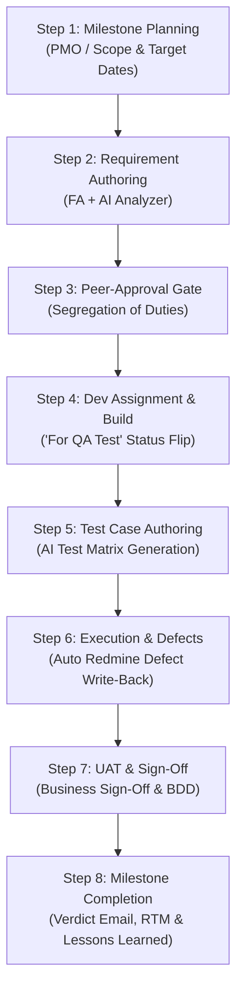

# 🎙️ QMPulse — End-to-End Live Demo Script
### *Executive Walkthrough: From Milestone Creation to UAT Sign-Off & Release Close*

---

## 📋 Demo Quick Reference
- **Total Demo Duration:** 10 – 12 Minutes
- **Target Audience:** C-Level Executives (CEO, CTO, CIO, COO, Head of PMO/QA) & Technical Directors
- **Demo Scenario:** Delivering a mission-critical release *(e.g., "Core Banking Modernization — Sprint 14 / CR-2026")*
- **Key Message to Reinforce:** *"One shared heartbeat — no spreadsheets, no email ping-pong, full audit compliance, and seamless Redmine + AI integration."*

---

## 🎬 Pre-Demo Checklist
1. Open your browser to `http://localhost:5173` (or production URL).
2. Log in with an account having full workflow privileges (e.g., `admin` or `qa_lead`).
3. Have Redmine open in a background tab if you want to show the live bi-directional sync.
4. Have this script open on your secondary screen or printed beside your laptop.

---

---

## 🌟 Stage-by-Stage Live Demo Script

---

### 🟢 INTRO: Setting the Executive Context (30 Seconds)

**🖥️ On Screen:** Landing Page or Main Dashboard.

**🗣️ What You Say:**
> *"Thank you, everyone. Now let us see QMPulse in live action. \n\n"
> "Imagine our team is delivering a critical business initiative—for example, our new Core Customer Portal. Typically, this would involve 15 different spreadsheets, dozens of emails, and disconnected Jira or Redmine tickets. \n\n"
> "Today, I will walk you through the entire delivery journey across all 8 stages—from the moment PMO creates the milestone, through AI-assisted requirement vetting, developer build, QA execution with auto-defect creation, all the way to final UAT sign-off and automated executive reporting."*

---

### 🟢 STEP 1: Milestone Planning & Governance (PMO View)

**🖥️ Navigation:** Navigate to **QA Pipeline → Step 1: Milestone** (or `/configurations` / Milestones).

**🖱️ What to Do:**
1. Select Project: *(e.g., "Core Banking Platform")*.
2. Enter Milestone Name: `Release 2.4 - Customer Security & Payments`.
3. Select Type: `Sprint` or `Change Request (CR)`.
4. Point to the Target Dates grid *(Requirements, Dev, QA, UAT, Go-Live)*.
5. Point to the checkbox: **"Requires UAT Sign-off?"** (Keep checked).
6. Click **Save / Create Milestone**.

**🗣️ What You Say:**
> *"Everything begins in Step 1 with our PMO. The PMO establishes the milestone, sets target dates across every lifecycle phase, assigns the target environment, and tracks initial risk.\n\n"
> "Notice the 'Requires UAT Sign-Off' toggle. When enabled, QMPulse enforces an automated governance gate that prevents the milestone from ever being closed or deployed without verified business sign-off.\n\n"
> "The moment PMO saves this milestone, automated notifications alert the Functional Analysts and Engineering Leads that the clock has officially started."*

**✨ Executive WOW Factor:** Point out that schedule health and target dates are tracked per phase, giving PMO early-warning indicators rather than discovering delays at the end.

---

### 🟢 STEP 2: Requirement Authoring & The AI Requirement Analyzer (FA View)

**🖥️ Navigation:** Click **Step 2: Requirements** on the pipeline top bar.

**🖱️ What to Do:**
1. Show existing requirements or click **+ Add Requirement** (or **Sync from Redmine**).
2. Show a sample requirement: *"User Biometric Authentication on Mobile App"*.
3. Click the **"AI Analyze Requirement"** button.
4. Watch the AI output modal populate with clarity scores, ambiguity warnings, and suggested edge cases.

**🗣️ What You Say:**
> *"Next, our Functional Analysts author the business specifications. In traditional projects, poorly specified requirements cause up to 60% of downstream production defects.\n\n"
> "Here, QMPulse introduces our built-in Google GenAI Requirement Analyzer. In real time, the AI scans the requirement text and flags ambiguities, untestable acceptance criteria, and missing negative test scenarios before a single line of code is written.\n\n"
> "This acts as our very first quality gate, ensuring developers and QA receive rock-solid specifications."*

**✨ Executive WOW Factor:** *"We catch defect-causing ambiguities at the requirement stage, where fixing them costs 10x less than fixing them in QA or production."*

---

### 🟢 STEP 3: Peer-Review & Segregation of Duties Gate

**🖥️ Navigation:** Click **Step 3: Test Cases / Step 4: Approval** (Requirements Review).

**🖱️ What to Do:**
1. Show the **Review Status** column (`Pending Review`, `Approved`, `Changes Requested`).
2. Show that the **Author** cannot click "Approve" on their own requirement.
3. Show the **"Assigned Peer Reviewer"** from the same project team.
4. Click **Approve** (as the designated peer reviewer).

**🗣️ What You Say:**
> *"Now let's look at enterprise compliance. QMPulse enforces strict Segregation of Duties. An analyst can never approve their own work.\n\n"
> "The system mandates a secondary peer review from another qualified FA within the same project. Once approved, the requirement is locked into our immutable audit trail and handed off to Development and QA simultaneously."*

---

### 🟢 STEP 4: Developer Build & Status Transition

**🖥️ Navigation:** Show the **Task Tracker / Redmine Task Integration** view.

**🖱️ What to Do:**
1. Point to the task card assigned to the developer with the linked requirement ID.
2. Show the status moving from `In Development` to `For QA Test`.
3. Highlight that this immediately updates Redmine without the developer having to enter duplicate logs.

**🗣️ What You Say:**
> *"Once approved, development begins. The Dev Lead assigns tasks with full specification context attached. \n\n"
> "When the developer completes the build and deploys to the test environment, they simply flip the status to 'For QA Test'. \n\n"
> "Notice what happens in parallel: The QA Lead and testing team receive an instant notification that the build is ready for verification."*

---

### 🟢 STEP 5: AI-Assisted Test Case Generation (QA View)

**🖥️ Navigation:** Click **Step 3: Test Cases** (or navigate to `/test-cases`).

**🖱️ What to Do:**
1. Show the Test Case Library mapped by module and requirement.
2. Click **"AI Generate Test Cases"** on a requirement.
3. Show how the AI generates positive, negative, and edge-case steps with expected results automatically.
4. Show the **"Compile to Execution File"** button.

**🗣️ What You Say:**
> *"While developers were writing code, our QA team was not sitting idle. They were authoring test cases in parallel.\n\n"
> "With one click, our QA team uses GenAI to auto-generate structured test cases directly from the approved requirements—including preconditions, exact step-by-step actions, and expected outcomes.\n\n"
> "This cuts test design effort by over 40% and ensures 100% test coverage against every business rule."*

---

### 🟢 STEP 6: Live Execution & Auto-Defect Creation in Redmine

**🖥️ Navigation:** Click **Step 5: Execution** (or `/test-cases/execution/:id`).

**🖱️ What to Do:**
1. Open an Execution File linked to the Redmine ticket.
2. Show the test rows with status badges: `Passed` (Green), `Failed` (Red), `Blocked` (Amber).
3. Mark a test step as **Passed** (show progress bar increase).
4. Mark a test step as **Failed** → *Watch the Defect Creation Modal open automatically!*
5. Show how the modal pre-populates:
   - Expected Result vs Actual Result
   - Assignee (synced from project memberships)
   - Scope: "This step" vs "Entire test case"
6. Click **Create Defect** → Show the generated clickable **Redmine Defect ID** linked directly.

**🗣️ What You Say:**
> *"Here is where QA executes the tests per environment. As testers mark steps, progress calculates in real time.\n\n"
> "Watch what happens when a test step Fails: The Defect Modal pops up instantly. The tester does not need to switch over to Redmine, copy-paste test steps, or re-type expected results.\n\n"
> "QMPulse captures the failing step, creates the defect as a child issue in Redmine, attaches screenshots, and links it back to the exact execution record. Zero defect leakage, zero manual copy-pasting."*

**✨ Executive WOW Factor:** Click the defect link to show that it exists in Redmine in real time.

---

### 🟢 STEP 7: UAT Verification & Business Sign-Off

**🖥️ Navigation:** Click **Step 7: UAT** on the pipeline bar.

**🖱️ What to Do:**
1. Show the UAT status dashboard.
2. Show the **UAT Document Register** (e.g., uploaded sign-off PDF / customer acceptance memo).
3. Click the **Review / Eye icon** to preview the attached sign-off certificate inline.
4. *(Optional)* Highlight the BDD / Gherkin test generator panel if applicable.

**🗣️ What You Say:**
> *"Once QA testing passes 100%, we transition to Step 7: User Acceptance Testing (UAT).\n\n"
> "The business stakeholders and product owners review the system in the UAT environment. When satisfied, the official signed UAT acceptance certificate is uploaded directly into the milestone repository.\n\n"
> "The system validates the document, timestamps the sign-off, and unlocks the final milestone close gate."*

---

### 🟢 STEP 8: Milestone Completion, Automated Verdict Reports & Lessons Learned

**🖥️ Navigation:** Click **Step 8: Complete** on the pipeline bar.

**🖱️ What to Do:**
1. Show the **Pre-Flight Governance Check List**:
   - `✔ Requirements synced & approved`
   - `✔ Test cases compiled & executed (100%)`
   - `✔ Zero open blocker defects`
   - `✔ UAT sign-off certificate verified`
2. Click **"Send PMO Verdict Report"** (or Show the Send Verdict Modal):
   - Inline executive HTML summary
   - Attached PDF sign-off report
   - Auto-generated Excel with Review Log, Pareto Analysis, and CAPA sheets
3. Click **"Complete Milestone"** → Show the celebration & completion badge.
4. Point out the **Lessons Learned & RTM (Requirements Traceability Matrix)** export.

**🗣️ What You Say:**
> *"Finally, we arrive at Step 8: Milestone Completion.\n\n"
> "Notice our Pre-Flight Governance Checks. QMPulse verifies that all requirements were approved, all tests were executed, all critical defects were resolved, and UAT sign-off is on file. Nothing can be rushed to production with loose ends.\n\n"
> "With a single click on 'Send Verdict Report', QMPulse generates an executive HTML email delivered directly via Office 365, attaches the formal PDF sign-off certificate, and exports an audit-ready Excel workbook containing complete Pareto defect analysis and CAPA tracking.\n\n"
> "We click 'Complete Milestone'—the release is locked, and lessons learned are archived for continuous organizational improvement."*

**✨ Executive WOW Factor:** Show the pre-generated Excel sheet tabs (*Summary, Pareto Analysis, CAPA*) and mention that this used to take days of manual Excel merging.

---

### 🟢 CONCLUSION & OPENING FOR Q&A (30 Seconds)

**🖥️ On Screen:** Executive PMO Dashboard / Overview.

**🗣️ What You Say:**
> *"To summarize what you just witnessed: In under 10 minutes, we went from milestone planning, AI-validated requirements, dev build, and parallel test execution, to live Redmine defect tracking, UAT sign-off, and one-click executive governance.\n\n"
> "QMPulse eliminates the blind spots, protects our delivery dates, and elevates our engineering quality standards across the entire enterprise.\n\n"
> "Thank you, and I would be glad to answer any questions or show specific modules in deeper detail."*

---

## 🎯 Pro-Tips for Demo Day
- **Mouse Movement:** Move the cursor deliberately. Avoid frantic clicking; pause 2 seconds on key badges so the executives can read them.
- **Narrate the 'Why', not just the 'What':** Don't just say *"Here is a button"*; say *"This button automates a 3-hour manual reporting task into a 2-second action."*
- **If an AI response takes 2-3 seconds:** Use that moment to say: *"Notice how Google GenAI is analyzing our business rules in real time against enterprise quality heuristics."*
- **Focus on C-Suite ROI:** Remind them that this system provides total governance for compliance audits without slowing down the development team.
