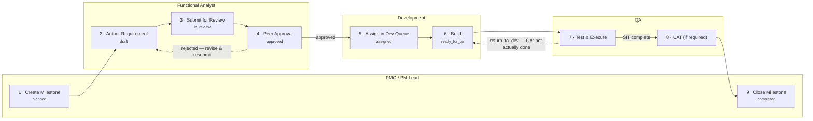

```mermaid
flowchart LR
    subgraph QA["QA (pipeline operator)"]
        n1["Step 1 · Create Milestone<br/><small>planned</small>"]
        n2["Step 2 · Sync Requirements"]
        n4["Step 2 · Assign Owners"]
        n5["Step 3 · Draft Test Cases"]
        n7["Step 3 · Compile &amp; Submit<br/><small>in_review</small>"]
        n9["Step 5 · Execute &amp; Log Defects"]
        n12["Step 7 · Upload UAT Sign-offs"]
        n14["Step 8 · Readiness Checklist"]
        n15["Step 8 · RTM &amp; Release Notes"]
        n17["Step 8 · Mark as DEPLOYED<br/><small>completed</small>"]
    end

    subgraph AI["AI Assist"]
        n3["Step 2 · AI Analyze"]
        n6["Step 3 · Risk-Based Priority"]
        n10["Step 5 · Release-Risk Assessment"]
        n13["Step 7 · BDD &rarr; Test Cases"]
    end

    subgraph LEAD["Approval Authority (QA Lead / Manager / HOD)"]
        n8["Step 4 · Approve Execution File<br/><small>approved</small>"]
        n11["Step 6 · Sign Off Functional Testing<br/><small>signedOffAt</small>"]
    end

    n16{"Step 8 · All 7 gates met?"}

    n1 --> n2 --> n3 --> n4 --> n5 --> n6 --> n7 --> n8
    n8 -- approved --> n9
    n8 -. "rejected — revise &amp; resubmit" .-> n7
    n9 --> n10 --> n11
    n11 -- requires UAT --> n12
    n11 -. "no UAT — skip to Step 8" .-> n14
    n12 --> n13 --> n14
    n14 --> n15 --> n16
    n16 -- all gates met --> n17
```

# QAPulse — Two Delivery Pipelines

Every milestone runs through exactly one of **two independent delivery flows**, decided by a single flag: `pipelineEnabled`. They share the same underlying tables (requirements, execution files, defects) but different owners, gates, and UI.

| | Classic Delivery Flow | QA Pipeline |
|---|---|---|
| Flag | `pipelineEnabled: false` | `pipelineEnabled: true` |
| Where | Requirements / Tasks / Execution Dashboard / Milestones pages | `/qa-pipeline` guided 8-step wizard |
| Owned by | Lead-tier across departments (`canWrite`: `admin`, `qa_lead`, `fa_lead`, `hod_qa`, `hod_fa`, `hod_pm`, `pm_lead`, `pm_member`, `cto`) | QA department (`qa_member`, `qa_lead`, `qa_manager`, `hod_qa`, `admin`, `cto`) |
| Requirements | Hand-authored, peer-reviewed by a different FA (segregation of duties enforced server-side) | Synced straight from Redmine — no FA authoring or peer review step |
| Closure | A Lead manually sets status to Completed | 7 gates re-checked live; "Mark as DEPLOYED" is disabled until all pass |

For the full interactive version with status chips, loop routing, and the deploy gate drawn out, open [`qapulse-milestone-swimlane.html`](./qapulse-milestone-swimlane.html) in a browser. The diagrams below are GitHub-renderable fallbacks — Mermaid doesn't support true horizontal swimlanes, so lanes are grouped as subgraphs instead.

## A · Classic Delivery Flow

Source: `artifacts/api-server/src/routes/requirements.ts`, `milestones.ts`, `test-execution.ts`.

A requirement can be flagged `isBlocked` by FA/PM at any point, freezing dev hand-off until cleared — independent of the steps above.

## B · QA Pipeline

Source: `artifacts/qa-pulse/src/pages/QAPipeline.tsx`, `src/components/qa-pipeline/Step1Milestone.tsx`–`Step8Complete.tsx`, `computePipelineState()` (`artifacts/api-server/src/routes/dashboard.ts`).

## Behaviors worth calling out

- **Segregation of duties on both flows.** Classic: the author of a requirement can never peer-approve it. Pipeline: any QA reviewer can approve/reject an execution file except the one who submitted it.
- **Only the QA Pipeline has a live readiness gate.** Classic closure is a Lead manually flipping a status dropdown to Completed; the Pipeline's Step 8 re-derives 7 gates from real data every time it's viewed and disables deploy until all pass.
- **Only the Classic flow has FA authorship and peer review.** The Pipeline syncs requirements straight from Redmine — there's no draft/in_review/approved cycle for the requirement text itself, only for the compiled execution file.
- **`return_to_dev` (Classic) has no Pipeline equivalent.** QA can send a `ready_for_qa` requirement back to `in_progress` if the build isn't actually done — a loop that doesn't exist in the guided wizard.
