# QAPulse — QA Deployment Pipeline Swimlane

A role-by-role view of the **QA Deployment Pipeline** (`/qa-pipeline`) — the 8-step guided flow QA runs for one milestone, from creating it through marking it deployed. Grounded directly in the implementation: `artifacts/qa-pulse/src/pages/QAPipeline.tsx`, `src/components/qa-pipeline/Step1Milestone.tsx` through `Step8Complete.tsx`, and the shared readiness gates in `computePipelineState()` (`artifacts/api-server/src/routes/dashboard.ts`) — the same seven checks Step 8's checklist and the Tasks board both read from.

For the full interactive version with status chips and the approve/reject and UAT-skip routing drawn out, open [`qapulse-milestone-swimlane.html`](./qapulse-milestone-swimlane.html) in a browser. The diagram below is a GitHub-renderable fallback — Mermaid doesn't support true horizontal swimlanes, so lanes are grouped as subgraphs instead.

```mermaid
flowchart LR
    subgraph QA["QA (pipeline operator)"]
        n1["Step 1 · Create Milestone<br/><small>planned</small>"]
        n2["Step 2 · Sync Requirements"]
        n4["Step 2 · Assign Owners"]
        n5["Step 3 · Draft Test Cases"]
        n7["Step 3 · Compile &amp; Submit<br/><small>in_review</small>"]
        n9["Step 5 · Execute &amp; Log Defects"]
        n12["Step 7 · Upload UAT Sign-offs"]
        n14["Step 8 · Readiness Checklist"]
        n15["Step 8 · RTM &amp; Release Notes"]
        n17["Step 8 · Mark as DEPLOYED<br/><small>completed</small>"]
    end

    subgraph AI["AI Assist"]
        n3["Step 2 · AI Analyze"]
        n6["Step 3 · Risk-Based Priority"]
        n10["Step 5 · Release-Risk Assessment"]
        n13["Step 7 · BDD &rarr; Test Cases"]
    end

    subgraph LEAD["Approval Authority (QA Lead / Manager / HOD)"]
        n8["Step 4 · Approve Execution File<br/><small>approved</small>"]
        n11["Step 6 · Sign Off Functional Testing<br/><small>signedOffAt</small>"]
    end

    n16{"Step 8 · All 7 gates met?"}

    n1 --> n2 --> n3 --> n4 --> n5 --> n6 --> n7 --> n8
    n8 -- approved --> n9
    n8 -. "rejected — revise &amp; resubmit" .-> n7
    n9 --> n10 --> n11
    n11 -- requires UAT --> n12
    n11 -. "no UAT — skip to Step 8" .-> n14
    n12 --> n13 --> n14
    n14 --> n15 --> n16
    n16 -- all gates met --> n17
```

## Roles in this pipeline

| Lane | Who | Access |
|---|---|---|
| QA (pipeline operator) | Anyone with QA Pipeline access | `qa_member`, `qa_lead`, `qa_manager`, `hod_qa`, `admin`, `cto` |
| Approval Authority | QA Lead / Manager / HOD tier only | Execution-file approve/reject (Step 4) and formal functional sign-off (Step 6) |
| AI Assist | — | Requirement analysis (PII-gated), risk-based test priority, release-risk/defect-leakage prediction, BDD→test case generation, release notes drafting |

Named per-requirement owners (FA · Dev · QA, set in Step 2) are **not** pipeline actors — they're tags that surface as Assignees on the Tasks board for visibility, not a gate any step checks.

## Key behaviors

- **Free-roam navigation.** Every step (1–8) is reachable directly from the sidebar — QA doesn't have to move through them in order, and multiple people can work different steps in parallel. `pipelineStep` persists so position survives a reload.
- **Segregation of duties on Step 4.** Any QA reviewer can approve or reject an execution file *except* the one who submitted it (`qaPicSetBy === ctx.userId` is blocked).
- **Step 6 is a hard role gate.** Only `qa_lead`, `qa_manager`, `hod_qa`, `admin`, or `cto` can sign off functional testing — everyone else sees the button disabled.
- **Step 7 is conditional.** It's only required when the milestone's "Requires UAT Sign-off?" toggle (set in Step 1) is on; otherwise Step 6 routes straight to Step 8 and the step shows as not applicable.
- **Step 8 re-derives readiness live**, from the same seven gates the Tasks board's pipeline-state computation uses:

  | # | Gate |
  |---|---|
  | 1 | Requirements synced (`requirementCount > 0`) |
  | 2 | Test cases compiled for execution (an execution file exists) |
  | 3 | Test cases approved (every execution file `reviewStatus === approved`) |
  | 4 | Test execution finished (no rows left `Not Executed`) |
  | 5 | Functional testing signed off (`signedOffAt` set) |
  | 6 | UAT sign-off document uploaded (only when `requiresUat`) |
  | 7 | Deployed (`status === completed`) |

- **Locked on deploy.** Once "Mark as DEPLOYED" sets `status: completed`, all 8 steps become read-only — only the milestone's dates/details stay editable via the Edit dialog.
